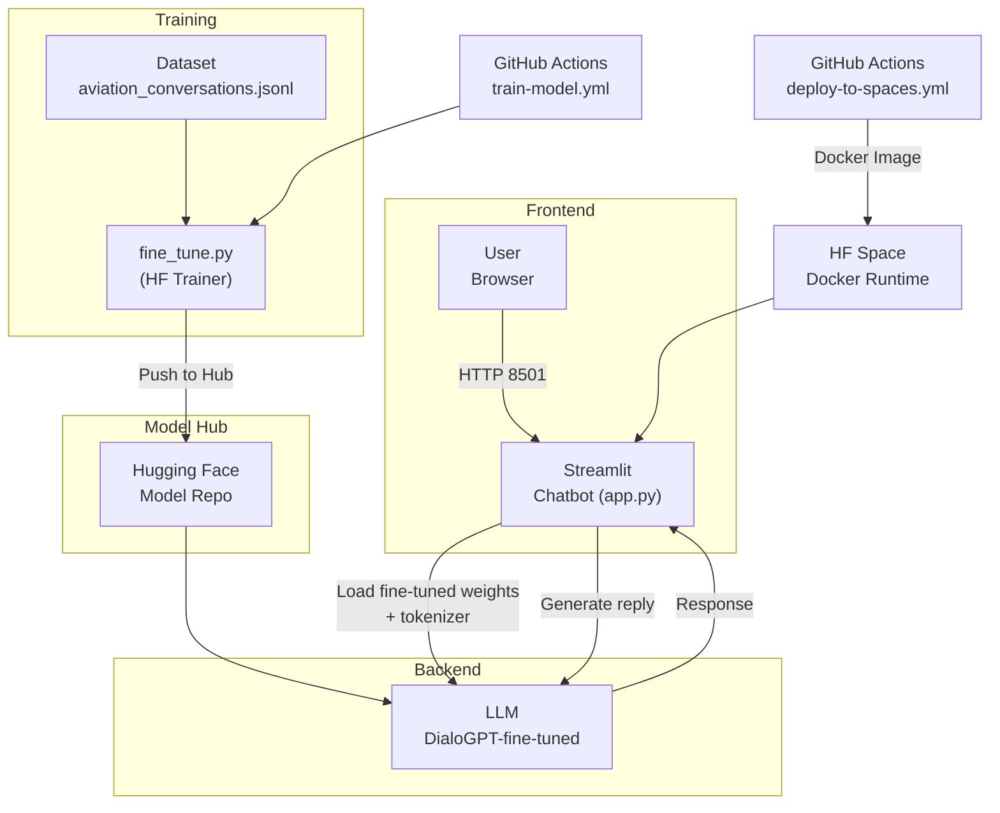

# Streamlit Chatbot ✨

A lightweight chatbot built with [Streamlit](https://streamlit.io/) and the open-source `microsoft/DialoGPT-small` language model from [Hugging Face](https://huggingface.co/). This repository is ready to be deployed to [Hugging Face Spaces](https://huggingface.co/spaces) automatically through GitHub Actions.

## Features

* 📜 **Open-source LLM** – Uses a small conversational model that runs comfortably on the free GPU or CPU hardware offered by Spaces.
* 💬 **Chat interface** – Powered by Streamlit 1.30+ `st.chat_*` components.
* 🔄 **Persistent history** – Session-state keeps the discussion context on the client side.
* 🚀 **1-click deploy** – Push to the `main` branch and GitHub Actions mirrors the repository to your Space.

---

## Quick start (local)

```bash
# 1. Install dependencies
python -m venv .venv && source .venv/bin/activate
pip install -r requirements.txt

# 2. Launch the app
streamlit run app.py
```

The app will open in your browser at `http://localhost:8501`.

---

## Quick start (Docker)

If you prefer to run the chatbot in a container instead of a local virtual-env, use the provided `Dockerfile`.

```bash
# 1. Build the image (tagged "streamlit-chatbot")
docker build -t streamlit-chatbot .

# 2. Run the container and expose the app on http://localhost:8501
docker run --rm -it -e PORT=8501 -p 8501:8501 streamlit-chatbot
```

The container entrypoint launches Streamlit on the port given by the `PORT` environment variable (the same variable Hugging Face uses). By passing `-e PORT=8501` and mapping `-p 8501:8501`, you can access the interface in your browser at `http://localhost:8501`.

---

## Manual deploy to Hugging Face Spaces (CLI)

If you'd rather push the repository yourself (skipping GitHub Actions):

```bash
# 1. Authenticate once (stores your token locally)
huggingface-cli login   # paste your HF_TOKEN when prompted

# 2. (First time only) create the Space as a Docker Space
huggingface-cli repo create afscomercial/streamlit-chatbot \
  --repo-type space --space-sdk docker -y  # change the name accordingly

# 3. Add the new remote and push
cd path/to/streamlit_chatbot

git lfs install                 # enables Large-File Storage just in case
git remote add hf \
  https://huggingface.co/spaces/afscomercial/streamlit-chatbot

git push hf main --force        # overwrite contents of the Space
```

After the push the Space will rebuild the Docker image and redeploy automatically.

---

## Repository layout

```
.
├── app.py                      # Streamlit application – chat UI
├── fine_tune.py                # Script to fine-tune the base LLM on JSONL data
├── requirements.txt            # Python dependencies
├── data/                       # Example datasets (small, can live in git)
│   └── aviation_conversations.jsonl
├── research/                   # Jupyter notebooks / ad-hoc DS experiments (untracked by CI)
├── .streamlit/
│   └── config.toml             # UI & server settings
├── .github/
│   └── workflows/
│       ├── deploy-to-spaces.yml  # CI/CD – auto-deploy app
├── Dockerfile                  # Container definition for Docker/HF Spaces
└── README.md
```

## Research folder
The `research/` directory is reserved for exploratory notebooks, data-science experiments, and scratch work that shouldn't affect the production application. Feel free to place notebooks, CSVs, or prototype scripts here. Anything computationally heavy or containing large files should **not** be committed; the folder is in the `.gitignore` by default.

## Fine-tuning the model (aviation example)

This repo ships with a tiny JSON-Lines dataset in `data/` that contains sample Q&A about aviation. A GitHub Action (`train-model.yml`) fine-tunes `microsoft/DialoGPT-small` on that data and pushes the checkpoint to the Hub as `afscomercial/streamlit-chatbot-aviation` (or the repo name you set in the `MODEL_REPO` secret).

You can also run it locally:

```bash
python -m venv .venv && source .venv/bin/activate
pip install -r requirements.txt

export HF_TOKEN=YOUR_WRITE_TOKEN
export MODEL_REPO="afscomercial/streamlit-chatbot-aviation"
python fine_tune.py
```

The script will train for one epoch (change `EPOCHS` if you wish) and push the new weights to the model repo.

### Where the model is used
`app.py` now reads the environment variable `MODEL_REPO` (defaulting to `afscomercial/streamlit-chatbot-aviation`). At startup, the Streamlit app downloads the fine-tuned checkpoint instead of the vanilla DialoGPT model.

### Pushing the fine-tuned model to the Hub

There are two convenient ways to upload your checkpoint to the Hub once the training run is finished.

#### Option 1 — let the training script push automatically
`fine_tune.py` ends with `trainer.push_to_hub()`, so you only need to:

```bash
# 1 · Authenticate once (stores your token locally)
huggingface-cli login                     # paste your HF access token

# 2 · (First time only) create the model repo on the Hub
huggingface-cli repo create <USER>/<MODEL_REPO> -y
#     e.g.  huggingface-cli repo create your-username/streamlit-chatbot-aviation -y

# 3 · Point the run to that repo (default shown below)
export MODEL_REPO="your-username/streamlit-chatbot-aviation"

# 4 · Launch training — the script will commit + push automatically
python fine_tune.py
```

#### Option 2 — push an existing folder manually
If you already have the fine-tuned files on disk (e.g. in `finetuned-aviation/`):

```bash
# 1 · Create the repo once
huggingface-cli repo create your-username/streamlit-chatbot-aviation -y

# 2 · Clone the empty repo & copy your files into it
git clone https://huggingface.co/your-username/streamlit-chatbot-aviation
cd streamlit-chatbot-aviation
cp -r /path/to/finetuned-aviation/* .

# 3 · Commit and push
git add .
git commit -m "First fine-tuned checkpoint"
git push
```

After the checkpoint is online, simply point the Streamlit app to it (locally or on Spaces) with:

```bash
export MODEL_REPO="your-username/streamlit-chatbot-aviation"
streamlit run app.py
```

## Architecture



---